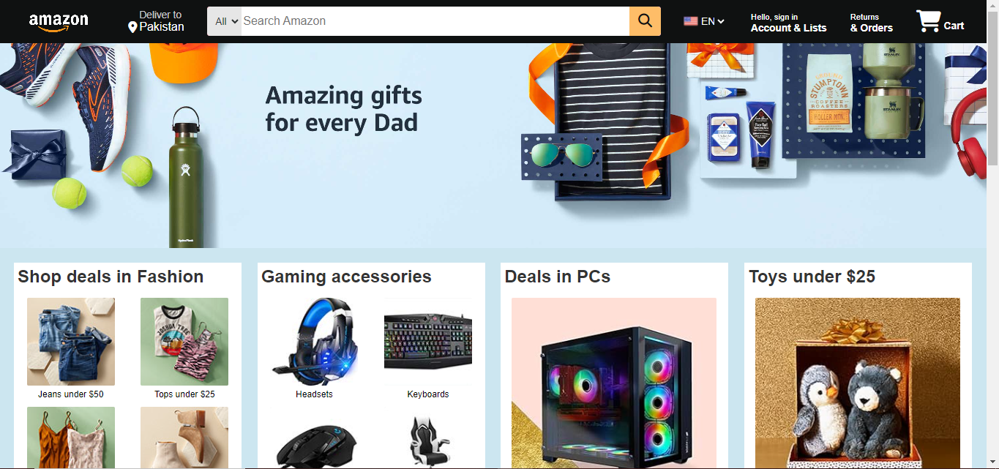
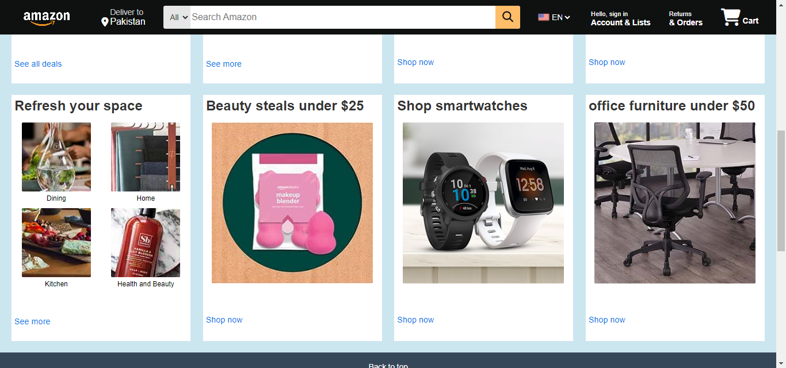
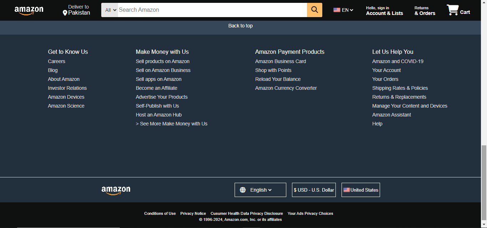

# Amazon Clone

This repository contains a clone of the Amazon website built using only HTML and CSS. This project is a part of my learning journey and currently demonstrates my skills in layout techniques such as Grid and Flexbox. Future updates will incorporate JavaScript to enhance interactivity. Please note that this project is not yet responsive.

## Features
- Static web page resembling Amazon's layout
- Use of CSS Grid for layout
- Use of Flexbox for alignment
- Integration of Font Awesome for icons
  
## Technologies Used

- HTML
- CSS
  - Grid
  - Flexbox
    
## Resources
- [Font Awesome](https://fontawesome.com) for icons

## Installation

1. Clone the repository
   ```sh
   git clone https://github.com/your-username/amazon-clone.git
2. Open the index.html file in your browser to view the project

##Screenshots



